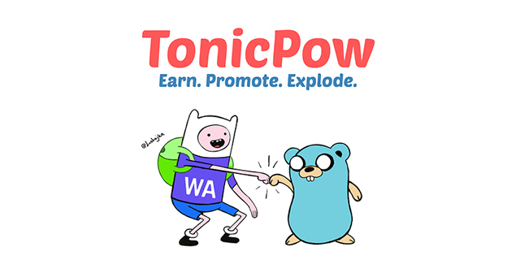

> The official Go implementation for interacting with the [TonicPow API](https://docs.tonicpow.com)

[](https://github.com/tonicpow/go-tonicpow/releases)
[](https://travis-ci.com/tonicpow/go-tonicpow)
[](https://goreportcard.com/report/github.com/tonicpow/go-tonicpow)
[](https://golang.org/)
[](https://atlantistic.slack.com/app_redirect?channel=tonicpow)
[](https://pkg.go.dev/github.com/tonicpow/go-tonicpow)

<br/>

## Table of Contents
- [Installation](#installation)
- [Documentation](#documentation)
- [Examples & Tests](#examples--tests)
- [Benchmarks](#benchmarks)
- [Code Standards](#code-standards)
- [Usage](#usage)
- [Maintainers](#maintainers)
- [Contributing](#contributing)
- [License](#license)

<br/>

## Installation

**go-tonicpow** requires a [supported release of Go](https://golang.org/doc/devel/release.html#policy).
```shell script
go get -u github.com/tonicpow/go-tonicpow
```

<br/>

## Documentation
You can view the generated [documentation here](https://pkg.go.dev/github.com/tonicpow/go-tonicpow).

### Features
- [Client](client.go) is completely configurable
- Using [heimdall http client](https://github.com/gojek/heimdall) with exponential backoff & more
- Coverage for the [TonicPow.com API](https://docs.tonicpow.com/)
    - [x] [Authentication](https://docs.tonicpow.com/#632ed94a-3afd-4323-af91-bdf307a399d2)
    - [x] [Users](https://docs.tonicpow.com/#50b3c130-7254-4a05-b312-b14647736e38)
    - [x] [Advertiser Profiles](https://docs.tonicpow.com/#2f9ec542-0f88-4671-b47c-d0ee390af5ea)
    - [x] [Campaigns](https://docs.tonicpow.com/#5aca2fc7-b3c8-445b-aa88-f62a681f8e0c)
    - [x] [Goals](https://docs.tonicpow.com/#316b77ab-4900-4f3d-96a7-e67c00af10ca)
    - [x] [Conversions](https://docs.tonicpow.com/#75c837d5-3336-4d87-a686-d80c6f8938b9)
    - [x] [Links](https://docs.tonicpow.com/#ee74c3ce-b4df-4d57-abf2-ccf3a80e4e1e)
    - [x] [Visitors](https://docs.tonicpow.com/#d0d9055a-0c92-4f55-a370-762d44acf801)
    - [x] [Rates](https://docs.tonicpow.com/#fb00736e-61b9-4ec9-acaf-e3f9bb046c89)

<details>
<summary><strong><code>Library Deployment</code></strong></summary>
<br/>

[goreleaser](https://github.com/goreleaser/goreleaser) for easy binary or library deployment to Github and can be installed via: `brew install goreleaser`.

The [.goreleaser.yml](.goreleaser.yml) file is used to configure [goreleaser](https://github.com/goreleaser/goreleaser).

Use `make release-snap` to create a snapshot version of the release, and finally `make release` to ship to production.
</details>

<details>
<summary><strong><code>Makefile Commands</code></strong></summary>
<br/>

View all `makefile` commands
```shell script
make help
```

List of all current commands:
```text
all                    Runs multiple commands
clean                  Remove previous builds and any test cache data
clean-mods             Remove all the Go mod cache
coverage               Shows the test coverage
godocs                 Sync the latest tag with GoDocs
help                   Show this help message
install                Install the application
install-go             Install the application (Using Native Go)
lint                   Run the Go lint application
release                Full production release (creates release in Github)
release                Runs common.release then runs godocs
release-snap           Test the full release (build binaries)
release-test           Full production test release (everything except deploy)
replace-version        Replaces the version in HTML/JS (pre-deploy)
run-examples           Runs all the examples
tag                    Generate a new tag and push (tag version=0.0.0)
tag-remove             Remove a tag if found (tag-remove version=0.0.0)
tag-update             Update an existing tag to current commit (tag-update version=0.0.0)
test                   Runs vet, lint and ALL tests
test-short             Runs vet, lint and tests (excludes integration tests)
test-travis            Runs all tests via Travis (also exports coverage)
test-travis-short      Runs unit tests via Travis (also exports coverage)
uninstall              Uninstall the application (and remove files)
vet                    Run the Go vet application
```
</details>

<br/>

## Examples & Tests
All unit tests and [examples](tonicpow_test.go) run via [Travis CI](https://travis-ci.org/tonicpow/go-tonicpow) and uses [Go version 1.14.x](https://golang.org/doc/go1.14). View the [deployment configuration file](.travis.yml).

View a [full example application](examples/examples.go).

Run all tests (including integration tests)
```shell script
make test
```

Run tests (excluding integration tests)
```shell script
make test-short
```

<br/>

## Benchmarks
Run the Go [benchmarks](tonicpow_test.go):
```shell script
make bench
```

<br/>

## Code Standards
Read more about this Go project's [code standards](CODE_STANDARDS.md).

<br/>

## Usage
View the [examples & benchmarks](tonicpow_test.go)

Basic implementation:
```go
package main

import (
    "os"
    
    "github.com/tonicpow/go-tonicpow"
)

func main() {
    api, _ := tonicpow.NewClient(os.Getenv("TONICPOW_API_KEY"), tonicpow.LiveEnvironment, nil)
    _, _ = api.CreateConversionByGoalName("landing-page-lead", "visitor-tncpw-session-guid", "from: my blog", 0, 0)
}
```

<br/>

## Maintainers
| [](https://github.com/mrz1836) | [](https://github.com/rohenaz) |
|:---:|:---:|
| [MrZ](https://github.com/mrz1836) | [Satchmo](https://github.com/rohenaz) |

<br/>

## Contributing
If you're looking for a library using JavaScript, checkout [tonicpow-js](https://github.com/tonicpow/tonicpow-js)

View the [contributing guidelines](CONTRIBUTING.md) and follow the [code of conduct](CODE_OF_CONDUCT.md).

Support the development of this project 🙏

[](https://tonicpow.com/?af=go-tonicpow) [](https://twitter.com/intent/tweet?text=TonicPow%20integration%20with%20Go%20rocks!%20Check%20it%20out:%20https%3A%2F%2Ftncpw.co%2F7ca46e94) [](https://twetch.app/compose?description=TonicPow%20integration%20with%20Go%20rocks!%20Check%20it%20out:%20https%3A%2F%2Ftncpw.co%2F7ca46e94)

<br/>

## License

[](/LICENSE)
